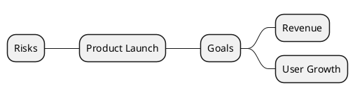

# Markdown Viewer 介绍

> 文档: <https://docu.md/>

> 相关下载链接
> - [Chrome 插件 (兼容 Edge) 下载](https://chromewebstore.google.com/detail/markdown-viewer/jekhhoflgcfoikceikgeenibinpojaoi)
> - [VSCode 插件下载](https://marketplace.visualstudio.com/items?itemName=xicilion.markdown-viewer-extension)
> - [配套 Skills 地址](https://github.com/markdown-viewer/skills)
---

原代码库参见 [README.md](README-org.md), 通过 Skills 生成样例文档参见 [skills-demo](./skills-demo.md), 导出 Word 文档参见 [skills-demo-exported](./skills-demo-exported.docx)

## 一、Markdown Viewer 概述

Markdown Viewer 是一款多平台 Markdown 扩展工具，核心定位是 **"Markdown to perfect Word in one click"**，将 Markdown 一键转换为 Word 文档，同时支持图表、公式和主题。

### 核心能力

| 能力     | 说明                                                                      |
| -------- | ------------------------------------------------------------------------- |
| 图表转换 | PlantUML、Mermaid、Vega、drawio、Canvas、Infographic、Graphviz → 高清图片 |
| 公式支持 | LaTeX 公式 → Word 可编辑公式（非图片）                                    |
| 代码高亮 | 自动语法高亮，支持 100+ 编程语言                                          |
| 主题系统 | 29 个专业主题，涵盖多种视觉风格                                           |
| 性能优化 | 智能缓存，首次加载 5s，二次加载 1s                                        |
| 隐私保护 | 所有处理在本地完成，不上传任何数据                                        |

### 支持平台

| 平台         | 说明          |
| ------------ | ------------- |
| Chrome 扩展  | 主要平台      |
| Firefox 扩展 | 支持          |
| VS Code 扩展 | 支持          |
| 移动端       | iOS / Android |

### 许可证

开源 ISC 许可证。

---

## 二、Skills 系统架构

### 定位

Skills 是面向 **AI 编码 Agent** 的技能库，让 Agent 能直接在 Markdown 中生成高质量的图表和可视化内容。

### 安装

```bash
npx skills add markdown-viewer/skills
```

### 技能体系总览

共 **14 个技能**，基于 **5 种渲染引擎**：

| 渲染引擎       | 技能           | 代码围栏格式                   |
| -------------- | -------------- | ------------------------------ |
| **Standalone** | Vega           | ` ```vega-lite ` / ` ```vega ` |
| **Standalone** | Infographic    | ` ```infographic `             |
| **Standalone** | Canvas         | ` ```canvas `                  |
| **HTML/CSS**   | Architecture   | 直接嵌入 HTML                  |
| **HTML/CSS**   | Infocard       | 直接嵌入 HTML                  |
| **PlantUML**   | UML            | ` ```plantuml `                |
| **PlantUML**   | Cloud          | ` ```plantuml `                |
| **PlantUML**   | Network        | ` ```plantuml `                |
| **PlantUML**   | Security       | ` ```plantuml `                |
| **PlantUML**   | ArchiMate      | ` ```plantuml `                |
| **PlantUML**   | BPMN           | ` ```plantuml `                |
| **PlantUML**   | Data Analytics | ` ```plantuml `                |
| **PlantUML**   | IoT            | ` ```plantuml `                |
| **PlantUML**   | Mindmap        | ` ```plantuml `                |

### 技能目录结构

```
skill-name/
├── SKILL.md          # 技能定义和使用说明
├── examples/         # 示例代码
├── references/       # 详细参考文档
├── layouts/          # 布局模板（部分技能）
└── styles/           # 样式模板（部分技能）
```

---

## 三、各技能详细分析

---

### 3.1 Vega / Vega-Lite — 数据驱动图表

**适用场景：** 统计数据可视化 — 柱状图、折线图、散点图、热力图、面积图、雷达图、词云

**语法格式：**

````markdown
```vega-lite
{
  "$schema": "https://vega.github.io/schema/vega-lite/v5.json",
  "data": {"values": [...]},
  "mark": "bar",
  "encoding": {
    "x": {"field": "category", "type": "nominal"},
    "y": {"field": "value", "type": "quantitative"}
  }
}
```
````

**关键规则：**

| 规则               | 说明                                            |
| ------------------ | ----------------------------------------------- |
| 必须包含 `$schema` | 指定 Vega-Lite v5 或 Vega v5 schema             |
| 严格 JSON 语法     | 双引号、无尾逗号                                |
| 字段名大小写敏感   | `field: "Category"` 与 `field: "category"` 不同 |
| 类型必须合法       | quantitative / nominal / ordinal / temporal     |

**选择指南：** 90% 的图表用 Vega-Lite，仅雷达图、词云、力导向图使用完整 Vega。

**支持图表类型：**

| 图表类型 | 引擎      | mark 类型 |
| -------- | --------- | --------- |
| 柱状图   | Vega-Lite | bar       |
| 折线图   | Vega-Lite | line      |
| 散点图   | Vega-Lite | point     |
| 面积图   | Vega-Lite | area      |
| 饼图     | Vega-Lite | arc       |
| 热力图   | Vega-Lite | rect      |
| 雷达图   | Vega      | —         |
| 词云     | Vega      | —         |

---

### 3.2 Infographic — 模板化信息图表

**适用场景：** KPI 仪表盘、时间线、路线图、SWOT 分析、漏斗图、对比分析、组织架构

**语法格式（注意：非 YAML，使用空格分隔键值对）：**

````markdown
```infographic
infographic list-grid-badge-card
data
  title Key Metrics
  desc Annual performance overview
  items
    - label Total Revenue
      desc $1.28B | YoY +23.5%
    - label New Customers
      desc 3280 | YoY +45%
```
````

**模板体系：** 80+ 模板，按用途分为以下类别：

| 类别          | 模板示例                                                          | 数量 |
| ------------- | ----------------------------------------------------------------- | ---- |
| 功能列表/清单 | `list-grid-badge-card`, `list-zigzag-down-compact-card`           | 13+  |
| 时间线/里程碑 | `sequence-timeline-simple`, `sequence-timeline-rounded-rect-node` | 3    |
| 步骤流程      | `sequence-snake-steps-simple`, `sequence-circular-simple`         | 15+  |
| 产品路线图    | `sequence-roadmap-vertical-simple`                                | 2    |
| 漏斗/转化     | `sequence-filter-mesh-simple`, `sequence-funnel-simple`           | 2    |
| A/B 对比      | `compare-binary-horizontal-underline-text-vs`                     | 4    |
| SWOT 分析     | `compare-swot`                                                    | 1    |
| 优先级矩阵    | `quadrant-quarter-simple-card`                                    | 3    |
| 组织架构      | `hierarchy-tree-tech-style-capsule-item`                          | 4    |
| 图表          | `chart-pie-plain-text`, `chart-bar-plain-text`, `chart-wordcloud` | 7+   |

**数据字段：**

| 字段       | 用途                 | 示例                  |
| ---------- | -------------------- | --------------------- |
| `label`    | 项目标题（必需）     | `label Q1 Sales`      |
| `desc`     | 描述文字             | `desc $1.28B \| +20%` |
| `value`    | 数值（图表/漏斗用）  | `value 128`           |
| `time`     | 时间标签（时间线用） | `time Q1 2024`        |
| `icon`     | 图标 `mdi/icon-name` | `icon mdi/star`       |
| `illus`    | 插画 unDraw 名称     | `illus coding`        |
| `children` | 嵌套项（层级/对比）  | —                     |
| `done`     | 完成状态（清单用）   | `done true`           |

**主题：** 支持 `dark`、`hand-drawn` 预设，或自定义调色板 `palette #3b82f6 #8b5cf6 #f97316`。

**常见错误：**

| 错误                          | 正确                         |
| ----------------------------- | ---------------------------- |
| `title: My Title`（冒号语法） | `title My Title`（空格分隔） |
| `description Some text`       | `desc Some text`             |
| `steps:`                      | `items`（无冒号）            |

---

### 3.3 Canvas — 空间画布图

**适用场景：** 自由定位节点的空间布局图，遵循 [JSON Canvas 规范](https://jsoncanvas.org/spec/1.0/)

**语法格式：**

````markdown
```canvas
{
  "nodes": [
    {"id": "n1", "type": "text", "text": "Node 1", "x": 0, "y": 0, "width": 120, "height": 50}
  ],
  "edges": [
    {"id": "e1", "fromNode": "n1", "fromSide": "right", "toNode": "n2", "toSide": "left", "toEnd": "arrow"}
  ]
}
```
````

**节点类型：**

| 类型    | 必需字段 | 用途               |
| ------- | -------- | ------------------ |
| `text`  | `text`   | 自定义文本内容     |
| `file`  | `file`   | 引用外部文件       |
| `link`  | `url`    | 外部 URL 引用      |
| `group` | `label`  | 视觉容器，用于分组 |

**颜色预设：** 1=红, 2=橙, 3=黄, 4=绿, 5=青, 6=紫

---

### 3.4 Architecture — 系统架构图

**适用场景：** 技术栈、微服务拓扑、应用架构设计

**渲染方式：** 直接 HTML/CSS 嵌入（不使用代码围栏）

**视觉风格（12 种）：**

| 风格        | 色调     |
| ----------- | -------- |
| Steel Blue  | 钢蓝专业 |
| Ember Warm  | 暖色活力 |
| Neon Dark   | 暗色霓虹 |
| Stark Block | 粗犷块状 |
| Ocean Teal  | 海洋青绿 |
| Dusk Glow   | 黄昏暖光 |
| Rose Bloom  | 玫瑰粉   |
| Sage Forest | 鼠尾草绿 |
| Frost Clean | 冰霜清新 |
| Indigo Deep | 靛蓝深邃 |
| Pastel Mix  | 柔和混搭 |
| Slate Dark  | 板岩暗色 |

**布局模式（12 种）：** 三栏、单栏堆叠、左侧边栏、右侧边栏、管道流、双栏分割、仪表盘、网格目录、Banner+中心、嵌套容器、分层布局、连接器

**高级特性：** SVG 连接器、产品分组、子分组组件、用户标签、指标显示

---

### 3.5 Infocard — 编辑风格信息卡片

**适用场景：** 知识摘要、数据亮点、事件公告、单主题内容卡片，杂志级排版

**渲染方式：** 直接 HTML/CSS 嵌入，使用 `<style scoped>`

**样式家族（29 种样式，8 个家族）：**

| 家族             | 包含样式                                                                                                | 适用场景                     |
| ---------------- | ------------------------------------------------------------------------------------------------------- | ---------------------------- |
| 温暖编辑/叙事    | Editorial Warm, Customer Spotlight, Sunset Warm, Midcentury                                             | 知识摘要、案例分析、品牌故事 |
| 柔和生活/教学    | Soft Neutral, Slate Chalk, Education Studio                                                             | 教育、工作坊、生活方式       |
| 论文/研究/治理   | Paper Minimal, Lab Journal, Academic Paper, Policy Paper, Navy Formal, Japanese Minimal, Clinical Brief | 研究报告、学术论文、政策文件 |
| 商业/金融/信任   | Corporate Clean, Pitch Deck VC, Sales Room, Trust Center, Partner Channel                               | 商业报告、融资展示、合作伙伴 |
| 技术/运营        | Tech Blueprint, Engineering Whiteprint, Terminal Green                                                  | 技术文档、架构说明、运维状态 |
| 广播/声明/高对比 | Bold Contrast, News Broadcast, Incident Desk, Neo Brutalism, Swiss Grid                                 | 公告、事件报告、宣言         |
| 签名视觉         | Deep Night, Glassmorphism                                                                               | 娱乐、产品发布、高级展示     |

**布局骨架（20+ 种）：**

| 家族            | 布局                                                                             | 用途       |
| --------------- | -------------------------------------------------------------------------------- | ---------- |
| 核心单主题      | Hero Card, Quote Card, Split Panel, Stacked Modules                              | 单主题主导 |
| 指标/运营       | Metric Board, Financial Snapshot, Sales Brief, Terminal Window                   | 数据仪表盘 |
| 序列/路线图     | Timeline Flow, Roadmap Board, Funnel Stack, Incident Review                      | 流程展示   |
| 对比/决策       | Pros & Cons, Quadrant Matrix, Comparison                                         | 决策分析   |
| 网格/清单       | Bento Grid, Badge Grid, Checklist Board                                          | 多项展示   |
| 系统/关系       | Architecture Map, Radial Hub                                                     | 架构全景   |
| 文档/备忘       | Research Abstract, Board Memo, Policy Memo, Education Module, Healthcare Summary | 结构化文档 |
| 治理/审计       | Risk Register, Compliance Audit                                                  | 合规管理   |
| 叙事/利益相关者 | News Bulletin, Org Update, Customer Story, Partner Brief                         | 沟通汇报   |

**设计原则：**

- 密度分级：低密度（≤50词）用大字构图，中密度（50-200词）用英雄+支撑面板，高密度（200+词）用非对称多栏
- 色调自动检测：根据内容关键词自动匹配哲学/技术/文学/科学/商业/创意等色调
- 反 AI 审美检查：禁止等宽等高面板、禁止纯黑、禁止霓虹渐变、禁止 AI 惯用语

---

### 3.6 UML — 软件建模图

**适用场景：** 类图、序列图、活动图

**语法：** 标准 PlantUML 语法，` ```plantuml ` 代码围栏

**特性：** 9500+ mxgraph 图标库增强可视化

---

### 3.7 Cloud — 云架构图

**适用场景：** AWS、Azure、GCP、阿里云架构设计

**模板语法：**

```
mxgraph.<provider>.<icon> "Label" as <alias>
```

**支持的云平台图标：**

| 平台  | 前缀                       | 典型图标               |
| ----- | -------------------------- | ---------------------- |
| AWS   | `mxgraph.aws4.*`           | lambda, ec2, rds, s3   |
| Azure | `mxgraph.azure.*`          | vm, load_balancer, sql |
| GCP   | `mxgraph.gcp2.*`           | compute_engine, cloud  |
| 其他  | IBM, Kubernetes, OpenStack | —                      |

**连接类型：** `-->` 同步调用、`..>` 异步事件、`--` 物理连接

---

### 3.8 Network — 网络拓扑图

**适用场景：** LAN/WAN 布局、数据中心互联、物理/逻辑网络设计

**图标库：**

| 系列       | 前缀                   | 用途                              |
| ---------- | ---------------------- | --------------------------------- |
| Networks   | `mxgraph.networks.*`   | 通用网络设备                      |
| Cisco      | `mxgraph.cisco.*`      | Cisco 路由器/交换机               |
| Cisco 19   | `mxgraph.cisco19.*`    | Nexus 9300/5K/Fabric Interconnect |
| Cisco SAFE | `mxgraph.cisco_safe.*` | 安全设备（NGFW/WAF/IDS/SIEM）     |
| Citrix     | `mxgraph.citrix2.*`    | NetScaler/StoreFront              |

**连接类型：** `--` 物理链路、`-->` 有向流、`..` VPN/无线、`..>` 有向逻辑流

---

### 3.9 Security — 安全架构图

**适用场景：** IAM 流程、零信任模型、加密管道、威胁检测架构

**图标分类：**

| 类别       | 典型图标                                          |
| ---------- | ------------------------------------------------- |
| 身份与访问 | cognito, identity_and_access_management, sts      |
| 加密       | key_management_service, secrets_manager, cloudhsm |
| 网络安全   | network_firewall, shield, security_group          |
| 威胁检测   | guardduty, detective, security_hub                |

**架构类型：** IAM、加密管道、网络安全、威胁检测、合规审计、零信任、数据保护、多账户治理

---

### 3.10 ArchiMate — 企业架构图

**适用场景：** TOGAF 视点、分层企业架构建模（业务/应用/技术）、动机分析、迁移规划

**语法要点：**

- 必须包含 `!include <archimate/Archimate>`
- 元素声明：`Layer_Type(alias, "Label")`
- 关系声明：`Rel_Type(fromAlias, toAlias, "label")`
- 使用 `rectangle "Layer" { ... }` 分层

**分层体系：**

| 层级   | 宏前缀             | 典型元素                                            |
| ------ | ------------------ | --------------------------------------------------- |
| 业务层 | `Business_*`       | Actor, Role, Process, Service, Event                |
| 应用层 | `Application_*`    | Component, Service, Function, Interface, DataObject |
| 技术层 | `Technology_*`     | Device, Node, SystemSoftware, CommunicationNetwork  |
| 动机层 | `Motivation_*`     | Stakeholder, Driver, Goal, Requirement, Constraint  |
| 战略层 | `Strategy_*`       | Capability, Resource, CourseOfAction, ValueStream   |
| 实施层 | `Implementation_*` | WorkPackage, Deliverable, Plateau, Gap              |

**关系类型：** Composition（组合）、Aggregation（聚合）、Assignment（分配）、Realization（实现）、Serving（服务）、Triggering（触发）、Flow（流）、Access（访问）、Influence（影响）、Association（关联）、Specialization（特化）

**架构图类型：** 企业全景、应用集成、技术基础设施、业务能力、迁移规划、安全架构、数据架构、DevOps 管道

---

### 3.11 BPMN — 业务流程图

**适用场景：** 业务流程建模，使用 BPMN 标准的事件、网关、任务符号和精益映射符号

**语法：** PlantUML + mxgraph 模板

---

### 3.12 Data Analytics — 数据分析架构图

**适用场景：** 数据管道、数据湖、ETL 流程、数据仓库、BI 可视化架构

**核心模板：**

| 类型        | 用途               |
| ----------- | ------------------ |
| 数据湖      | 集中式原始数据存储 |
| 实时流处理  | 事件流处理架构     |
| 数据仓库    | 星型模式分析       |
| ETL 管道    | 提取-转换-加载流程 |
| 日志分析    | 集中式日志架构     |
| ML 特征存储 | 特征工程管道       |
| CDC 管道    | 数据库变更捕获     |
| 多源 BI     | 跨数据库报表       |

**数据来源图标：** S3、Glue、Redshift、QuickSight 等 AWS 分析服务

---

### 3.13 IoT — IoT 架构图

**适用场景：** 智能工厂、智能家居、车队遥测、边缘计算、数字孪生、传感器网络

**架构类型：** Smart Factory、Smart Home、Fleet Telemetry、Edge Computing、Digital Twin、Sensor Network、Device Management、Robotics

**图标：** IoT Core、传感器、IoT Thing 等 AWS IoT 服务图标

---

### 3.14 Mindmap — 思维导图

**适用场景：** 头脑风暴、主题分解、决策树

**语法：**



**层级标记：** `*` 根节点、`**` 一级、`***` 二级

**分支控制：** `+` 右侧分支、`-` 左侧分支、`left side` 切换到左侧

**样式：** 支持内联颜色 `[#Orange]`、自定义 CSS 类、多套调色板

---

## 四、渲染引擎对比

| 维度           | Vega              | Infographic      | Canvas            | HTML/CSS           | PlantUML           |
| -------------- | ----------------- | ---------------- | ----------------- | ------------------ | ------------------ |
| **语法复杂度** | 高（JSON spec）   | 中（自定义 DSL） | 中（JSON Canvas） | 高（HTML/CSS）     | 中（PlantUML DSL） |
| **学习曲线**   | 陡峭              | 平缓             | 平缓              | 陡峭               | 中等               |
| **输出质量**   | 专业图表          | 模板化精美       | 灵活空间          | 高度定制           | 标准化专业         |
| **适用领域**   | 数据可视化        | 商业展示         | 概念布局          | 架构/信息卡片      | 技术图表           |
| **AI 友好度**  | 高（结构化 JSON） | 高（简单 DSL）   | 高（结构化 JSON） | 中（需 HTML 知识） | 高（DSL 简洁）     |
| **模板数量**   | —                 | 80+              | —                 | 29+ 样式, 20+ 布局 | —                  |

---

## 五、对研究工作的实用价值评估

### 高价值场景

| 场景         | 推荐技能                       | 理由                         |
| ------------ | ------------------------------ | ---------------------------- |
| 技术架构展示 | Architecture, ArchiMate        | 专业分层架构图，支持多种风格 |
| 数据分析报告 | Vega                           | 专业统计图表，支持交互       |
| 研究进度展示 | Infographic (Timeline/Roadmap) | 清晰的时间线和里程碑         |
| 竞品对比     | Infographic (Compare/SWOT)     | 直观的对比和战略分析         |
| 知识卡片     | Infocard                       | 杂志级排版，适合研究摘要     |
| 思维导图     | Mindmap                        | 快速头脑风暴和主题分解       |
| 云架构设计   | Cloud                          | 支持 AWS/Azure/GCP 图标      |
| 网络架构设计 | Network                        | 支持 Cisco 等专业图标        |

### 使用建议

1. **入门优先：** Infographic 和 Mindmap 学习成本最低，适合快速上手
2. **数据展示：** Vega 是专业数据可视化的首选，但需要学习 Vega-Lite 规范
3. **技术文档：** Architecture + Infocard 组合可实现高质量技术文档
4. **企业架构：** ArchiMate 覆盖 TOGAF 全部视点，适合 EA 建模
5. **代码围栏注意：** PlantUML 系列必须用 ` ```plantuml `，不能用 ` ```text `；HTML/CSS 系列不使用代码围栏，直接嵌入

---

## 六、参考资料

| 资源                     | 地址                                      |
| ------------------------ | ----------------------------------------- |
| Markdown Viewer 官方文档 | <https://docu.md/>                          |
| Skills GitHub 仓库       | <https://github.com/markdown-viewer/skills> |
| JSON Canvas 规范         | <https://jsoncanvas.org/spec/1.0/>          |
| Vega-Lite 文档           | <https://vega.github.io/vega-lite/>         |
| PlantUML 文档            | <https://plantuml.com/>                     |
| Iconify 图标库           | <https://icon-sets.iconify.design/>         |
| unDraw 插画库            | <https://undraw.co/illustrations>           |
