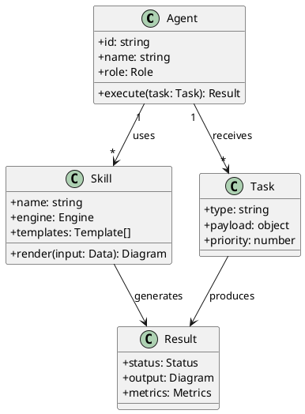
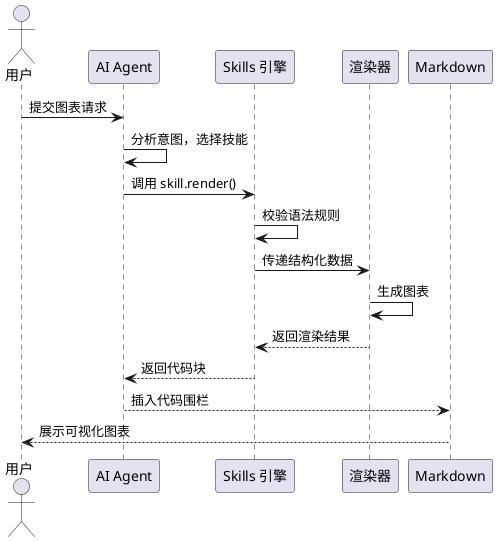
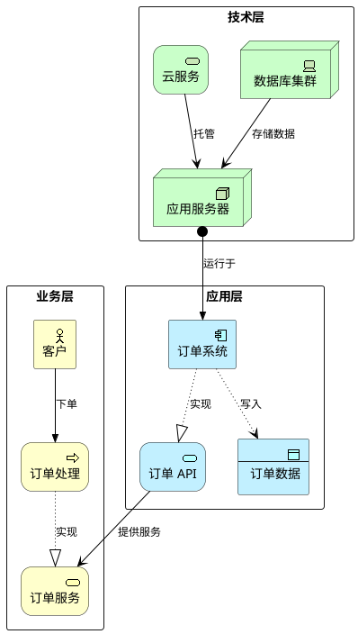
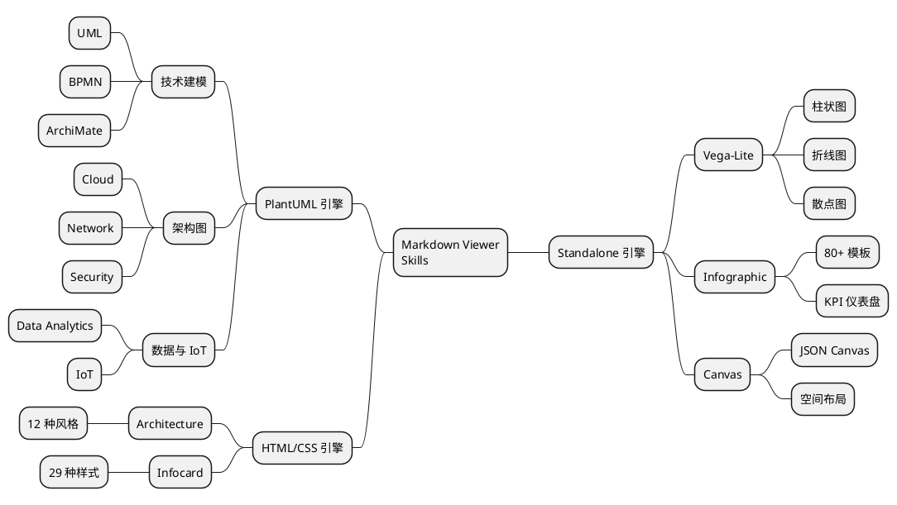

# Markdown Viewer Skills 完整演示

> 本文件涵盖全部 14 个技能的实际输出示例，需在 Markdown Viewer 扩展中预览。

---

## 1. Vega-Lite — 柱状图

```vega-lite
{
  "$schema": "https://vega.github.io/schema/vega-lite/v5.json",
  "title": "2025 年各季度营收（亿元）",
  "data": {
    "values": [
      {"quarter": "Q1", "revenue": 320},
      {"quarter": "Q2", "revenue": 480},
      {"quarter": "Q3", "revenue": 560},
      {"quarter": "Q4", "revenue": 610}
    ]
  },
  "mark": "bar",
  "encoding": {
    "x": {"field": "quarter", "type": "nominal", "axis": {"labelAngle": 0}},
    "y": {"field": "revenue", "type": "quantitative", "title": "金额（亿元）"},
    "color": {"field": "quarter", "type": "nominal", "scale": {"range": ["#4C78A8", "#F58518", "#E45756", "#72B7B2"]}}
  }
}
```

---

## 2. Vega-Lite — 折线图

```vega-lite
{
  "$schema": "https://vega.github.io/schema/vega-lite/v5.json",
  "title": "月活跃用户趋势",
  "data": {
    "values": [
      {"month": "1月", "users": 1200, "platform": "移动端"},
      {"month": "2月", "users": 1350, "platform": "移动端"},
      {"month": "3月", "users": 1580, "platform": "移动端"},
      {"month": "4月", "users": 1720, "platform": "移动端"},
      {"month": "1月", "users": 800, "platform": "桌面端"},
      {"month": "2月", "users": 820, "platform": "桌面端"},
      {"month": "3月", "users": 890, "platform": "桌面端"},
      {"month": "4月", "users": 910, "platform": "桌面端"}
    ]
  },
  "mark": "line",
  "encoding": {
    "x": {"field": "month", "type": "nominal"},
    "y": {"field": "users", "type": "quantitative", "title": "活跃用户（万）"},
    "color": {"field": "platform", "type": "nominal"}
  }
}
```

---

## 3. Infographic — 功能网格卡片

```infographic
infographic list-grid-badge-card
data
  title AI Agent 核心能力
  desc Markdown Viewer Skills 技术栈概览
  items
    - label 图表渲染
      desc 14 种技能 / 5 种引擎
      icon mdi/chart-bar
    - label 模板系统
      desc 80+ Infographic 模板
      icon mdi/view-grid
    - label 云架构
      desc AWS / Azure / GCP
      icon mdi/cloud
    - label 企业建模
      desc TOGAF / ArchiMate
      icon mdi/sitemap
    - label 数据管道
      desc ETL / 流处理 / BI
      icon mdi/database
    - label 安全架构
      desc 零信任 / IAM / 合规
      icon mdi/shield-check
```

---

## 4. Infographic — 时间线

```infographic
infographic sequence-timeline-simple
data
  title 项目研发里程碑
  items
    - label 需求分析
      time 2025 Q1
      desc 用户调研与需求梳理
    - label 原型设计
      time 2025 Q2
      desc 交互原型与视觉设计
    - label 核心开发
      time 2025 Q3
      desc 前后端开发与集成
    - label 测试上线
      time 2025 Q4
      desc 性能调优与发布
```

---

## 5. Infographic — SWOT 分析

```infographic
infographic compare-swot
data
  title AI Agent 技能平台 SWOT 分析
  items
    - label Strengths
      children
        - label 14 种技能覆盖面广
        - label 5 种渲染引擎灵活适配
    - label Weaknesses
      children
        - label 依赖 Markdown Viewer 扩展
        - label 部分引擎学习曲线较陡
    - label Opportunities
      children
        - label AI Agent 工作流快速增长
        - label 企业可视化需求旺盛
    - label Threats
      children
        - label 竞品 Mermaid 生态成熟
        - label 原生 AI 绘图工具崛起
```

---

## 6. Infographic — 漏斗图

```infographic
infographic sequence-funnel-simple
data
  title 用户转化漏斗
  items
    - label 访问页面
      value 10000
      desc 全渠道流量
    - label 注册账号
      value 3500
      desc 35% 转化率
    - label 激活使用
      value 1800
      desc 51% 转化率
    - label 付费转化
      value 620
      desc 34% 转化率
```

---

## 7. Infographic — 组织架构

```infographic
infographic hierarchy-tree-tech-style-capsule-item
data
  title 技术团队组织架构
  items
    - label CTO
      children
        - label 前端团队
          children
            - label Web 开发
            - label 移动端开发
        - label 后端团队
          children
            - label 微服务
            - label 数据平台
        - label DevOps
          children
            - label CI/CD
            - label 基础设施
```

---

## 8. Infographic — 优先级矩阵

```infographic
infographic quadrant-quarter-simple-card
data
  title 技能优先级矩阵
  items
    - label 核心技能
      desc 高价值 × 易上手
      children
        - label Infographic
        - label Mindmap
    - label 进阶技能
      desc 高价值 × 需学习
      children
        - label Vega
        - label ArchiMate
    - label 按需使用
      desc 低频 × 易上手
      children
        - label Canvas
        - label BPMN
    - label 专家技能
      desc 低频 × 高门槛
      children
        - label Infocard
        - label Architecture
```

---

## 9. Canvas — 空间画布

```canvas
{
  "nodes": [
    {"id": "n1", "type": "text", "text": "用户\n浏览器", "x": 0, "y": 100, "width": 120, "height": 60, "color": "4"},
    {"id": "n2", "type": "text", "text": "API\n网关", "x": 200, "y": 100, "width": 120, "height": 60, "color": "2"},
    {"id": "n3", "type": "text", "text": "认证\n服务", "x": 400, "y": 0, "width": 120, "height": 60, "color": "1"},
    {"id": "n4", "type": "text", "text": "业务\n服务", "x": 400, "y": 100, "width": 120, "height": 60, "color": "5"},
    {"id": "n5", "type": "text", "text": "数据库", "x": 600, "y": 100, "width": 120, "height": 60, "color": "6"},
    {"id": "n6", "type": "text", "text": "缓存\nRedis", "x": 400, "y": 200, "width": 120, "height": 60, "color": "3"}
  ],
  "edges": [
    {"id": "e1", "fromNode": "n1", "fromSide": "right", "toNode": "n2", "toSide": "left", "toEnd": "arrow"},
    {"id": "e2", "fromNode": "n2", "fromSide": "right", "toNode": "n3", "toSide": "left", "toEnd": "arrow"},
    {"id": "e3", "fromNode": "n2", "fromSide": "right", "toNode": "n4", "toSide": "left", "toEnd": "arrow"},
    {"id": "e4", "fromNode": "n4", "fromSide": "right", "toNode": "n5", "toSide": "left", "toEnd": "arrow"},
    {"id": "e5", "fromNode": "n4", "fromSide": "bottom", "toNode": "n6", "toSide": "top", "toEnd": "arrow"}
  ]
}
```

---

## 10. UML — 类图



---

## 11. UML — 序列图



---

## 12. Cloud — AWS 架构图

```plantuml
@startuml
left to right direction

rectangle "用户层" {
  mxgraph.aws4.route53 "Route 53\nDNS" as dns
  mxgraph.aws4.cloudfront "CloudFront\nCDN" as cdn
}

rectangle "计算层" {
  mxgraph.aws4.application_load_balancer "ALB" as alb
  mxgraph.aws4.ec2 "EC2\n实例组" as ec2
  mxgraph.aws4.lambda "Lambda\n函数" as lambda
}

rectangle "数据层" {
  mxgraph.aws4.rds "RDS\nMySQL" as rds
  mxgraph.aws4.elasticache "ElastiCache\nRedis" as cache
  mxgraph.aws4.s3 "S3\n存储桶" as s3
}

dns --> cdn
cdn --> alb
alb --> ec2
alb --> lambda
ec2 --> rds
ec2 --> cache
lambda --> s3
lambda --> rds
@enduml
```

---

## 13. Network — 网络拓扑图

```plantuml
@startuml
left to right direction

rectangle "互联网" {
  mxgraph.networks.cloud "Internet" as inet
}

rectangle "DMZ 区域" {
  mxgraph.networks.firewall "防火墙" as fw
  mxgraph.cisco.switches.layer_3_switch "核心交换机" as sw
}

rectangle "服务器区" {
  mxgraph.networks.server "Web 服务器" as web
  mxgraph.networks.server "应用服务器" as app
  mxgraph.networks.database "数据库服务器" as db
}

rectangle "办公区" {
  mxgraph.networks.pc "工作站" as pc1
  mxgraph.networks.pc "工作站" as pc2
}

inet --> fw
fw --> sw
sw --> web
sw --> app
web --> app
app --> db
sw --> pc1
sw --> pc2
@enduml
```

---

## 14. Security — 安全架构图

```plantuml
@startuml
left to right direction

rectangle "身份认证" {
  mxgraph.aws4.cognito "Cognito\n用户池" as cognito
  mxgraph.aws4.identity_and_access_management "IAM\n权限控制" as iam
}

rectangle "网络安全" {
  mxgraph.aws4.network_firewall "Network\nFirewall" as nfw
  mxgraph.aws4.shield "Shield\nDDoS防护" as shield
}

rectangle "数据保护" {
  mxgraph.aws4.key_management_service "KMS\n密钥管理" as kms
  mxgraph.aws4.secrets_manager "Secrets\nManager" as secrets
}

rectangle "威胁检测" {
  mxgraph.aws4.guardduty "GuardDuty\n威胁检测" as gd
  mxgraph.aws4.security_hub "Security\nHub" as sh
}

cognito --> iam
shield --> nfw
nfw --> kms
kms --> secrets
iam --> gd
gd --> sh
@enduml
```

---

## 15. ArchiMate — 企业架构图



---

## 16. BPMN — 业务流程图

```plantuml
@startuml
left to right direction

mxgraph.bpmn.shape "开始" as start #LightGreen
mxgraph.bpmn.task "提交订单" as submit
mxgraph.bpmn.gateway_x "审核?" as gateway
mxgraph.bpmn.task "库存扣减" as deduct
mxgraph.bpmn.task "通知补货" as notify
mxgraph.bpmn.task "发货处理" as ship
mxgraph.bpmn.end "结束" as end #LightCoral

start --> submit
submit --> gateway
gateway --> deduct : 通过
gateway --> notify : 拒绝
deduct --> ship
ship --> end
notify --> end
@enduml
```

---

## 17. Data Analytics — 数据管道架构

```plantuml
@startuml
left to right direction

mxgraph.aws4.s3 "S3\n数据湖" as s3
mxgraph.aws4.glue "Glue\nETL" as glue
mxgraph.aws4.kinesis "Kinesis\n流处理" as kinesis
mxgraph.aws4.redshift "Redshift\n数据仓库" as rs
mxgraph.aws4.quicksight "QuickSight\nBI 报表" as qs
mxgraph.aws4.athena "Athena\nSQL 查询" as athena

mxgraph.aws4.rds "RDS\n业务库" as rds
mxgraph.aws4.lambda "Lambda\nCDC 函数" as cdc

rds ..> cdc : CDC 变更捕获
cdc ..> s3 : 写入原始数据
kinesis ..> s3 : 实时流数据
s3 --> glue : ETL 清洗
glue --> rs : 加载数仓
s3 --> athena : 即席查询
rs --> qs : 可视化报表
athena --> qs : 查询结果
@enduml
```

---

## 18. IoT — 智能工厂架构

```plantuml
@startuml
left to right direction

rectangle "设备层" {
  mxgraph.aws4.sensor "温度\n传感器" as temp
  mxgraph.aws4.sensor "压力\n传感器" as press
  mxgraph.aws4.sensor "振动\n传感器" as vib
}

rectangle "边缘层" {
  mxgraph.aws4.iot_core "IoT Core\n设备管理" as iot
  mxgraph.aws4.greengrass "Greengrass\n边缘计算" as edge
}

rectangle "平台层" {
  mxgraph.aws4.iot_analytics "IoT Analytics\n数据分析" as analytics
  mxgraph.aws4.s3 "S3\n历史数据" as s3
  mxgraph.aws4.quicksight "QuickSight\n可视化" as qs
}

temp --> edge
press --> edge
vib --> edge
edge --> iot
iot --> analytics
iot --> s3
analytics --> qs
s3 --> analytics
@enduml
```

---

## 19. Mindmap — 技能体系思维导图



---

## 20. Architecture — 系统架构图（HTML/CSS）

<div style="max-width:900px;margin:0 auto;font-family:-apple-system,'Segoe UI',sans-serif;background:#0f172a;border-radius:16px;padding:40px;color:#e2e8f0;"><div style="display:flex;flex-direction:column;gap:8px;"><div style="font-size:22px;font-weight:800;margin-bottom:4px;color:#f1f5f9;">AI Agent 技能渲染架构</div><div style="font-size:13px;color:rgba(255,255,255,0.4);margin-bottom:20px;">5 层架构 · 14 种技能 · 多引擎协同</div><div style="padding:16px 20px;border-radius:10px;display:flex;align-items:center;gap:12px;flex-wrap:wrap;background:rgba(59,130,246,0.08);"><div style="font-size:12px;font-weight:700;text-transform:uppercase;letter-spacing:1px;width:80px;color:rgba(255,255,255,0.6);">接入层</div><div style="padding:10px 18px;border-radius:8px;font-size:13px;font-weight:500;color:#fff;background:rgba(59,130,246,0.25);border:1px solid rgba(59,130,246,0.4);">Chrome 扩展</div><div style="padding:10px 18px;border-radius:8px;font-size:13px;font-weight:500;color:#fff;background:rgba(59,130,246,0.25);border:1px solid rgba(59,130,246,0.4);">VS Code 扩展</div><div style="padding:10px 18px;border-radius:8px;font-size:13px;font-weight:500;color:#fff;background:rgba(59,130,246,0.25);border:1px solid rgba(59,130,246,0.4);">Firefox 扩展</div><div style="padding:10px 18px;border-radius:8px;font-size:13px;font-weight:500;color:#fff;background:rgba(59,130,246,0.25);border:1px solid rgba(59,130,246,0.4);">移动端 App</div></div><div style="text-align:center;color:rgba(255,255,255,0.3);font-size:18px;padding:2px 0;">↓</div><div style="padding:16px 20px;border-radius:10px;display:flex;align-items:center;gap:12px;flex-wrap:wrap;background:rgba(168,85,247,0.08);"><div style="font-size:12px;font-weight:700;text-transform:uppercase;letter-spacing:1px;width:80px;color:rgba(255,255,255,0.6);">调度层</div><div style="padding:10px 18px;border-radius:8px;font-size:13px;font-weight:500;color:#fff;background:rgba(168,85,247,0.2);border:1px solid rgba(168,85,247,0.35);">AI Agent</div><div style="padding:10px 18px;border-radius:8px;font-size:13px;font-weight:500;color:#fff;background:rgba(168,85,247,0.2);border:1px solid rgba(168,85,247,0.35);">Skills 引擎</div><div style="padding:10px 18px;border-radius:8px;font-size:13px;font-weight:500;color:#fff;background:rgba(168,85,247,0.2);border:1px solid rgba(168,85,247,0.35);">语法校验器</div></div><div style="text-align:center;color:rgba(255,255,255,0.3);font-size:18px;padding:2px 0;">↓</div><div style="padding:16px 20px;border-radius:10px;display:flex;align-items:center;gap:12px;flex-wrap:wrap;background:rgba(34,197,94,0.08);"><div style="font-size:12px;font-weight:700;text-transform:uppercase;letter-spacing:1px;width:80px;color:rgba(255,255,255,0.6);">渲染引擎</div><div style="padding:10px 18px;border-radius:8px;font-size:13px;font-weight:500;color:#fff;background:rgba(34,197,94,0.2);border:1px solid rgba(34,197,94,0.35);">Vega / Vega-Lite</div><div style="padding:10px 18px;border-radius:8px;font-size:13px;font-weight:500;color:#fff;background:rgba(34,197,94,0.2);border:1px solid rgba(34,197,94,0.35);">Infographic</div><div style="padding:10px 18px;border-radius:8px;font-size:13px;font-weight:500;color:#fff;background:rgba(34,197,94,0.2);border:1px solid rgba(34,197,94,0.35);">Canvas</div><div style="padding:10px 18px;border-radius:8px;font-size:13px;font-weight:500;color:#fff;background:rgba(34,197,94,0.2);border:1px solid rgba(34,197,94,0.35);">PlantUML</div><div style="padding:10px 18px;border-radius:8px;font-size:13px;font-weight:500;color:#fff;background:rgba(34,197,94,0.2);border:1px solid rgba(34,197,94,0.35);">HTML/CSS</div></div><div style="text-align:center;color:rgba(255,255,255,0.3);font-size:18px;padding:2px 0;">↓</div><div style="padding:16px 20px;border-radius:10px;display:flex;align-items:center;gap:12px;flex-wrap:wrap;background:rgba(245,158,11,0.08);"><div style="font-size:12px;font-weight:700;text-transform:uppercase;letter-spacing:1px;width:80px;color:rgba(255,255,255,0.6);">模板层</div><div style="padding:10px 18px;border-radius:8px;font-size:13px;font-weight:500;color:#fff;background:rgba(245,158,11,0.2);border:1px solid rgba(245,158,11,0.35);">80+ Info 模板</div><div style="padding:10px 18px;border-radius:8px;font-size:13px;font-weight:500;color:#fff;background:rgba(245,158,11,0.2);border:1px solid rgba(245,158,11,0.35);">12 架构风格</div><div style="padding:10px 18px;border-radius:8px;font-size:13px;font-weight:500;color:#fff;background:rgba(245,158,11,0.2);border:1px solid rgba(245,158,11,0.35);">29 卡片样式</div><div style="padding:10px 18px;border-radius:8px;font-size:13px;font-weight:500;color:#fff;background:rgba(245,158,11,0.2);border:1px solid rgba(245,158,11,0.35);">9500+ 图标</div></div><div style="text-align:center;color:rgba(255,255,255,0.3);font-size:18px;padding:2px 0;">↓</div><div style="padding:16px 20px;border-radius:10px;display:flex;align-items:center;gap:12px;flex-wrap:wrap;background:rgba(239,68,68,0.08);"><div style="font-size:12px;font-weight:700;text-transform:uppercase;letter-spacing:1px;width:80px;color:rgba(255,255,255,0.6);">输出层</div><div style="padding:10px 18px;border-radius:8px;font-size:13px;font-weight:500;color:#fff;background:rgba(239,68,68,0.2);border:1px solid rgba(239,68,68,0.35);">Markdown 预览</div><div style="padding:10px 18px;border-radius:8px;font-size:13px;font-weight:500;color:#fff;background:rgba(239,68,68,0.2);border:1px solid rgba(239,68,68,0.35);">Word 导出</div><div style="padding:10px 18px;border-radius:8px;font-size:13px;font-weight:500;color:#fff;background:rgba(239,68,68,0.2);border:1px solid rgba(239,68,68,0.35);">高清图片</div></div></div></div>

---

## 21. Infocard — 知识卡片（HTML/CSS）

<style scoped>
.ic-frame {max-width: 720px; margin: 0 auto; font-family: 'Georgia', 'Noto Serif SC', serif; background: #FAF8F4; border-radius: 12px; padding: 48px; color: #1a1a1a; line-height: 1.7;}
.ic-meta {font-size: 11px; text-transform: uppercase; letter-spacing: 2px; color: #999; margin-bottom: 8px; font-family: -apple-system, sans-serif;}
.ic-title {font-size: 32px; font-weight: 800; line-height: 1.2; margin-bottom: 12px; color: #1a1a1a; letter-spacing: -0.02em;}
.ic-bar {width: 48px; height: 4px; background: #7C6853; border-radius: 2px; margin-bottom: 20px;}
.ic-body {font-size: 15px; color: #4a4a4a; margin-bottom: 24px; line-height: 1.75;}
.ic-grid {display: grid; grid-template-columns: 1fr 1fr; gap: 16px; margin-bottom: 24px;}
.ic-panel {padding: 16px; border-top: 3px solid #7C6853; background: rgba(124,104,83,0.04); border-radius: 0 0 6px 6px;}
.ic-panel-label {font-size: 11px; text-transform: uppercase; letter-spacing: 1.5px; color: #7C6853; margin-bottom: 6px; font-family: -apple-system, sans-serif; font-weight: 700;}
.ic-panel-text {font-size: 13px; color: #555; line-height: 1.6;}
.ic-highlight {border-left: 4px solid #7C6853; padding-left: 14px; font-size: 14px; color: #333; margin-bottom: 20px; font-style: italic;}
.ic-footer {font-size: 11px; color: #aaa; border-top: 1px solid #eee; padding-top: 12px; font-family: -apple-system, sans-serif;}
</style>
<div class="ic-frame">
<div class="ic-meta">技术洞察 · 技能体系</div>
<div class="ic-title">Markdown Viewer Skills：AI Agent 的可视化能力层</div>
<div class="ic-bar"></div>
<div class="ic-body">Skills 系统将可视化能力封装为 14 个独立技能，覆盖从数据图表到企业架构建模的完整谱系。每个技能遵循统一的 SKILL.md 规范，包含语法规则、示例代码和参考文档，使 AI Agent 能以确定性的方式生成高质量图表。</div>
<div class="ic-highlight">5 种渲染引擎各有侧重 — PlantUML 覆盖 9 个技术建模场景，Infographic 以 80+ 模板实现商业展示的快速产出。</div>
<div class="ic-grid">
<div class="ic-panel">
<div class="ic-panel-label">设计哲学</div>
<div class="ic-panel-text">面向 Agent 而非人类设计，通过结构化 DSL 降低 AI 生成时的格式错误率。Infographic 使用空格分隔键值对（非 YAML），Vega 要求严格 JSON 规范。</div>
</div>
<div class="ic-panel">
<div class="ic-panel-label">核心价值</div>
<div class="ic-panel-text">消除工具切换：Agent 在 Markdown 中直接生成图表，无需 Visio、Figma 或专业绘图软件。所有处理本地完成，保障数据隐私。</div>
</div>
</div>
<div class="ic-footer">来源：github.com/markdown-viewer/skills · docu.md · 调研日期 2026-04-23</div>
</div>

---

## 技能速查表

| # | 技能 | 引擎 | 代码围栏 | 适用场景 |
|---|------|------|----------|----------|
| 1 | **Vega** | Standalone | ` ```vega-lite ` | 统计图表、数据可视化 |
| 2 | **Infographic** | Standalone | ` ```infographic ` | KPI、时间线、SWOT、漏斗 |
| 3 | **Canvas** | Standalone | ` ```canvas ` | 自由布局、空间关系 |
| 4 | **Architecture** | HTML/CSS | 直接嵌入 | 技术栈、微服务架构 |
| 5 | **Infocard** | HTML/CSS | 直接嵌入 | 知识卡片、信息摘要 |
| 6 | **UML** | PlantUML | ` ```plantuml ` | 类图、序列图、活动图 |
| 7 | **Cloud** | PlantUML | ` ```plantuml ` | AWS/Azure/GCP 架构 |
| 8 | **Network** | PlantUML | ` ```plantuml ` | 网络拓扑、数据中心 |
| 9 | **Security** | PlantUML | ` ```plantuml ` | 安全架构、零信任 |
| 10 | **ArchiMate** | PlantUML | ` ```plantuml ` | 企业架构、TOGAF |
| 11 | **BPMN** | PlantUML | ` ```plantuml ` | 业务流程建模 |
| 12 | **Data Analytics** | PlantUML | ` ```plantuml ` | 数据管道、ETL、BI |
| 13 | **IoT** | PlantUML | ` ```plantuml ` | 物联网、边缘计算 |
| 14 | **Mindmap** | PlantUML | ` ```plantuml ` | 思维导图、主题分解 |
